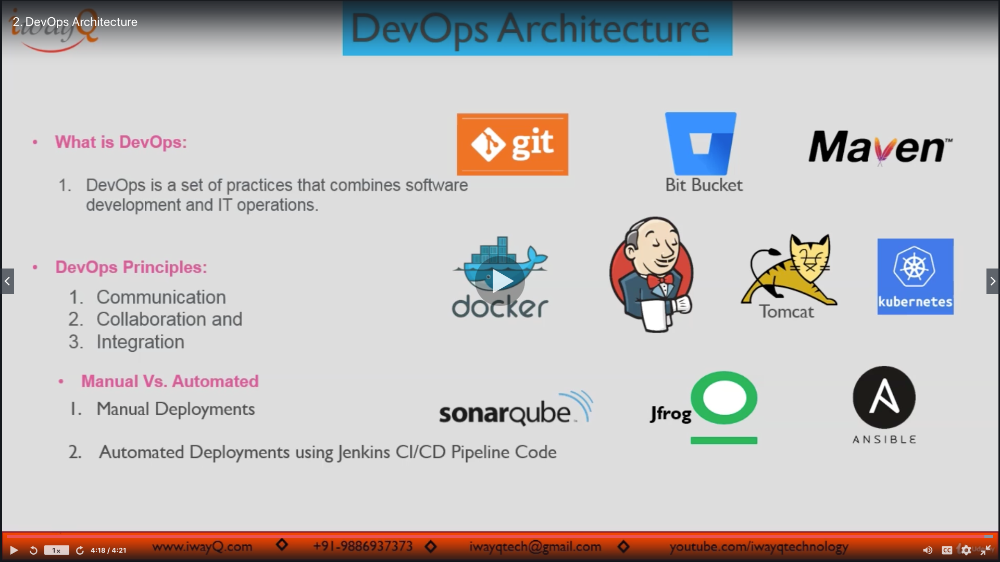

# Section01: DevOps Project | Course Introduction

<a id = "contents">

# Contents
* [DevOps Overview](#Overview)
* [DevOps Architecture](#Architecture)
* [DevOps Project: Code, Steps, Documentation](#project)

### Pickup
* 

<a id = "Overview">

## DevOps Overview
* 

### [Return to Contents](#contents)

<a id = "Architecture">

## DevOps Architecture
* 

### [Return to Contents](#contents)

<a id = "project">

## DevOps Project: Code, Steps, Documentation
* 

### Pickup
* [DevOps Project: Jenkins CI/CD for Kubernetes Deployments](https://www.iwayq.com/tutorial/devops-automation/kubernetes/devops-project-jenkins-cicd-for-kubernetes-deployments)
* [devops-pipeline-project](https://bitbucket.org/iwayqtech/devops-pipeline-project/src/master/)

### [Return to Contents](#contents)