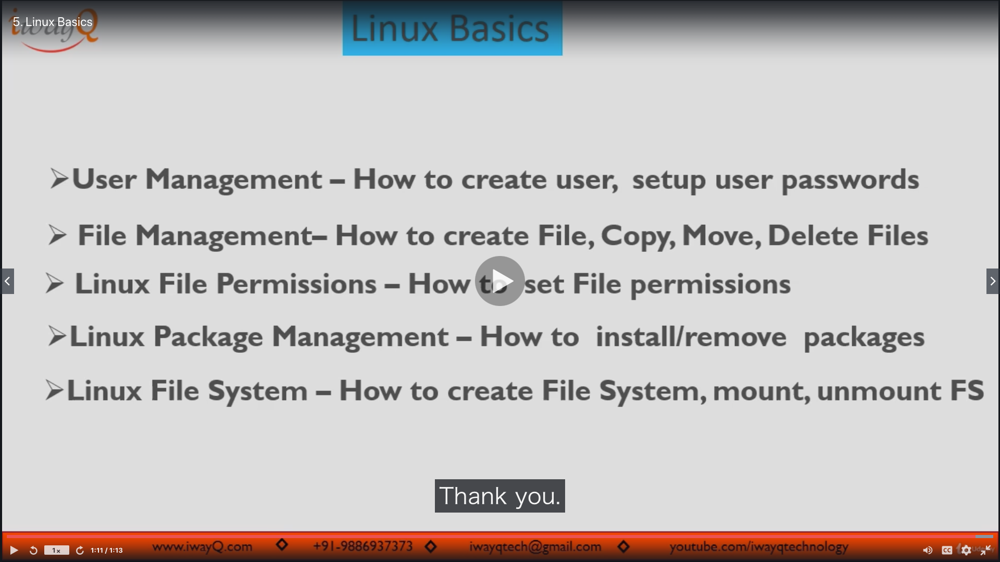

# Section02: Pre-Requisites - Key Skills Required Before Get Started with DevOps Project

<a id = "contents">

# Contents
* [Linux Basics](#linux)

### Pickup
* 

<a id = "linux">

## Linux Basics
* 

### Pickup
* [What is Linux?](https://www.iwayq.com/video/webseries/it-software/operating-system/linux-administrator-course)

### [Return to Contents](#contents)