# Section03: Git

<a id = "contents">

# Contents
* [Git Architecture](#Architecture)
* [Git - Practical LAB](#lab)

### Pickup
* [AWS Management Console](https://github.com/Pippippi3104/2020_DevOps_CICDwithJenkinsAnsibleDockerKubernetes/blob/main/doc/Section02_CICDpipeline.md#1st--aws-management-console)


<a id = "Architecture">

## Git Architecture
* 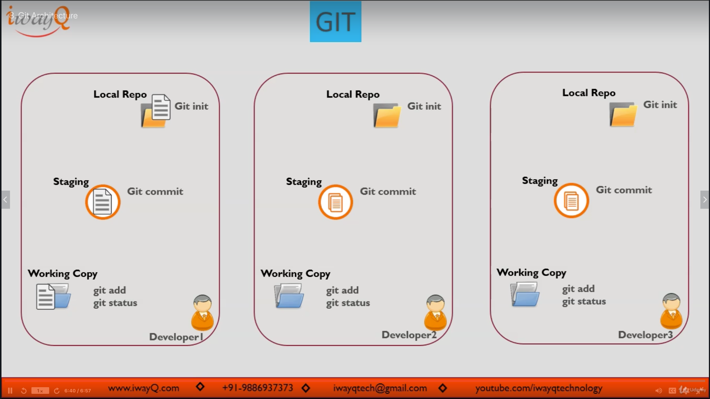

### [Return to Contents](#contents)


<a id = "lab">

## Git - Practical LAB
* 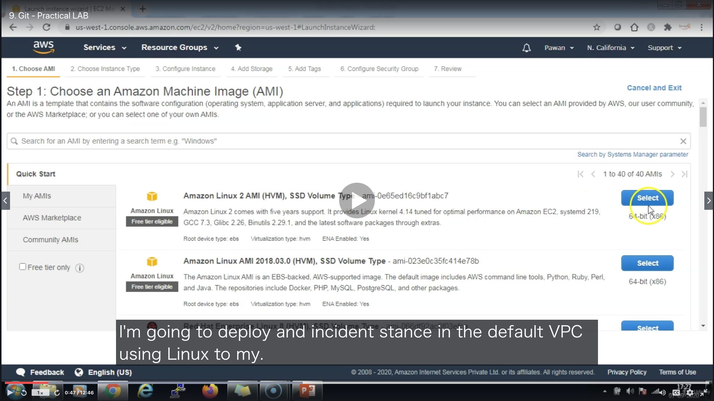
* 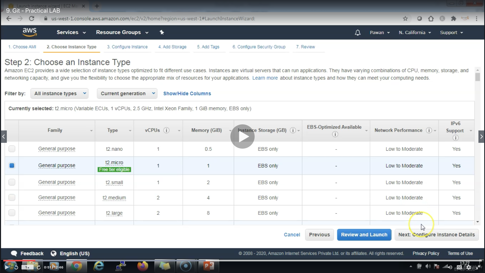
* 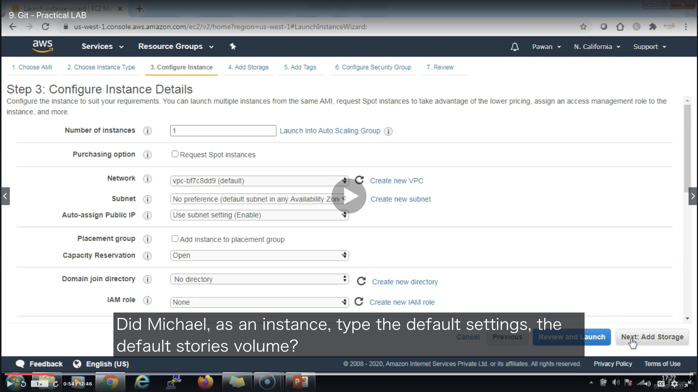
* 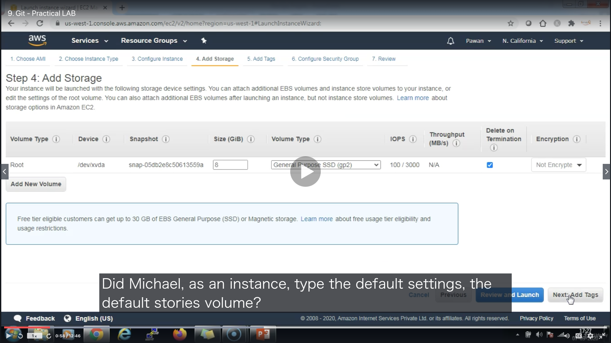
* 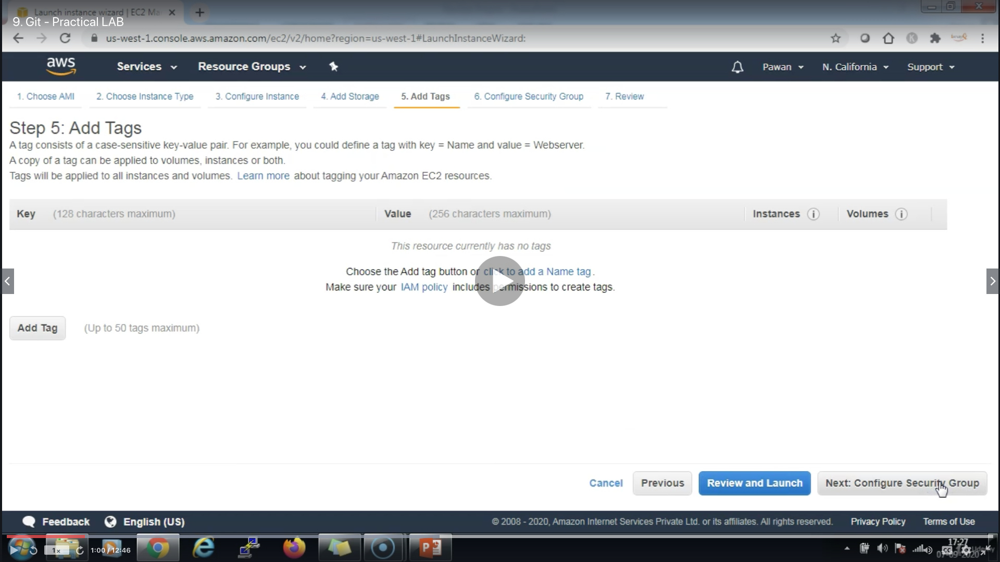
* 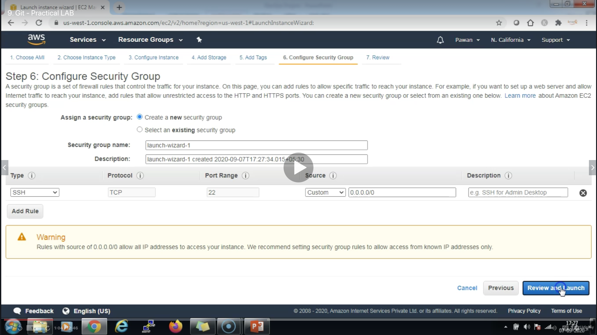
* 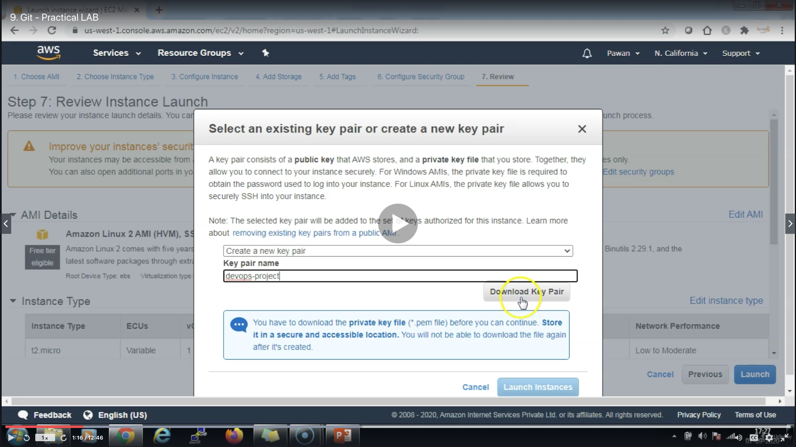
* 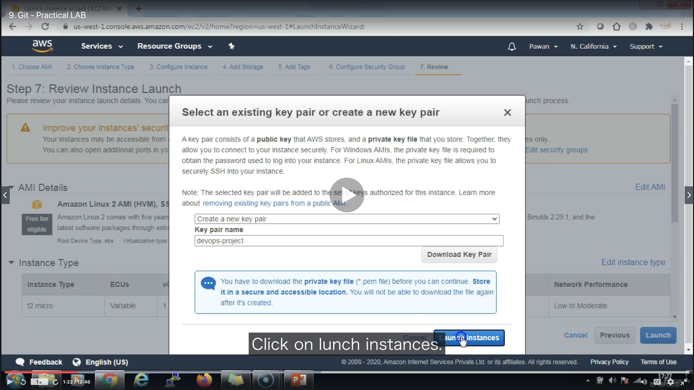
* 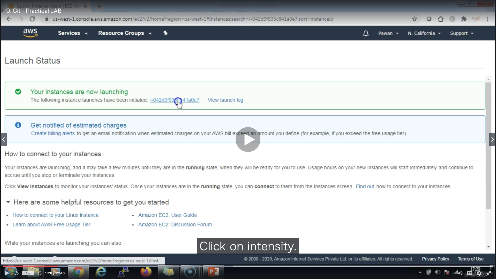
* 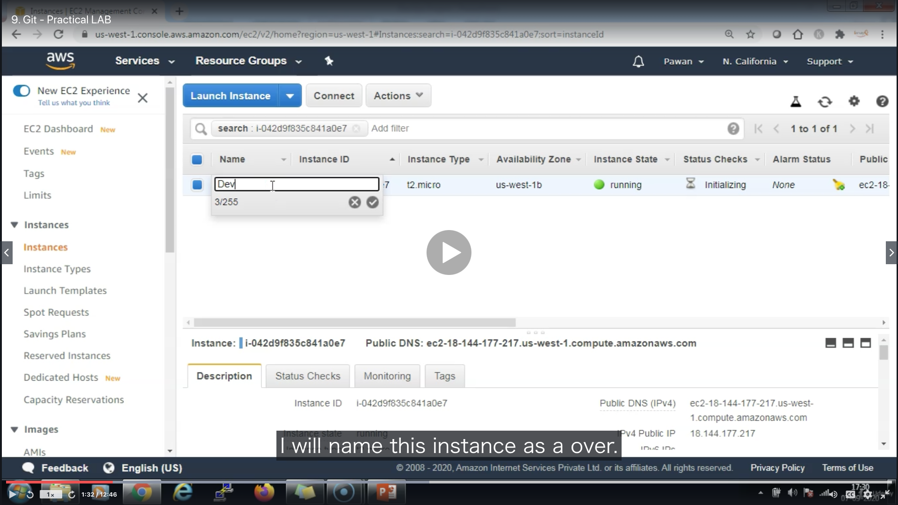
* 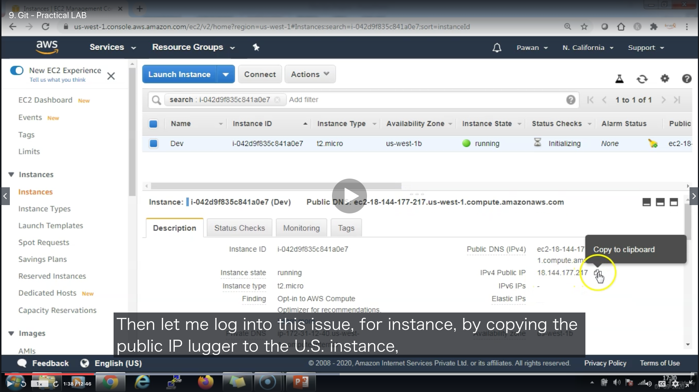
* 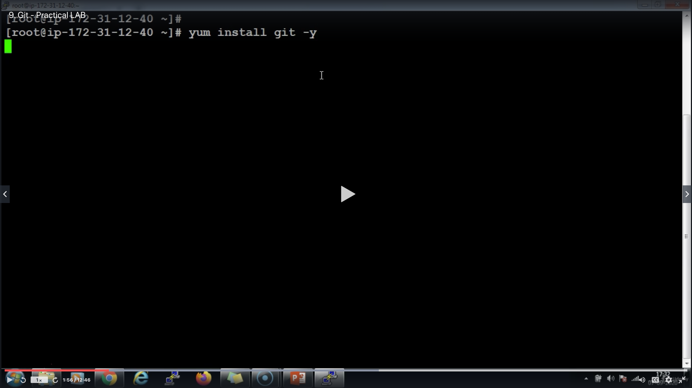
* 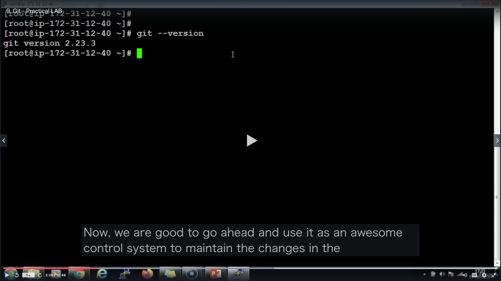
* 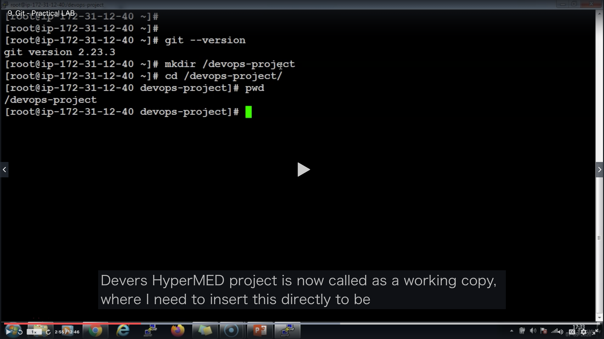
* 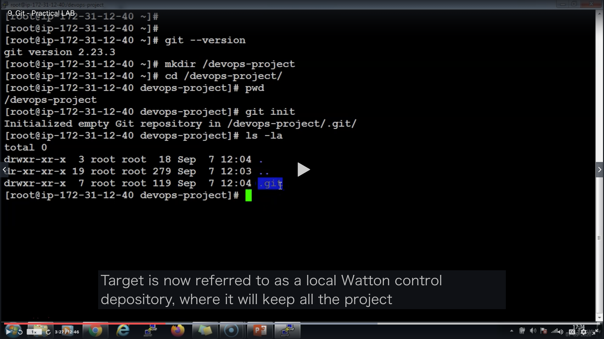

* commands
  ```
  cd ~/.ssh/keys
  cp ~/Desktop/devops-project.pem ./
  chmod 600 devops-project.pem
  ssh EC2アカウント名@IP -i ~/.ssh/keys/ダウンロードした鍵.pem (例: ssh ec2-user@3.15.158.192 -i ~/.ssh/keys/devops-project.pem)
  sudo su -
  ```
  * go to root
  ```
  yum install git -y
  git --version
  ```
  ```
  mkdir /devops-project
  cd /devops-project
  git init
  ls -la
  ```

### [Return to Contents](#contents)