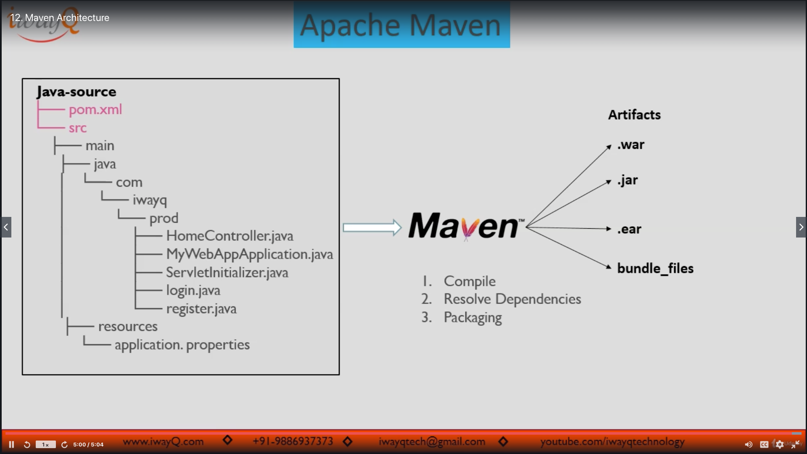
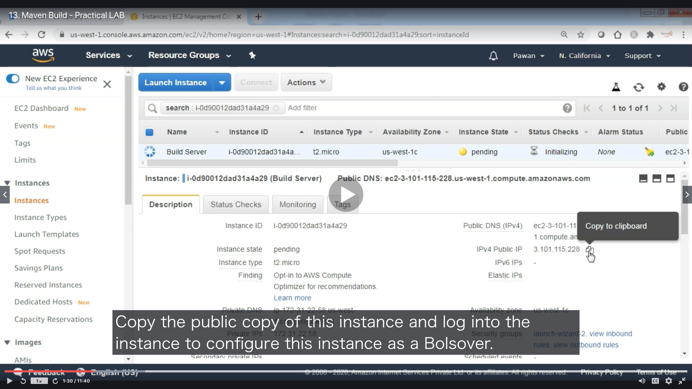

# Section05: Apache Maven

<a id = "contents">

# Contents
* [Maven Architecture](#Architecture)
* [Maven - Practical LAB](#lab)

### Pickup
* [AWS Management Console](https://github.com/Pippippi3104/2020_DevOps_CICDwithJenkinsAnsibleDockerKubernetes/blob/main/doc/Section02_CICDpipeline.md#1st--aws-management-console)


<a id = "Architecture">

## Maven Architecture
* 


<a id = "lab">

## Maven - Practical LAB
* 

* commands
  ```
  ```

### [Return to Contents](#contents)