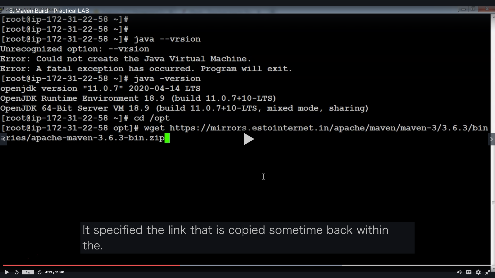

# Section05: Apache Maven

<a id = "contents">

# Contents
* [Maven Architecture](#Architecture)
* [Maven - Practical LAB](#lab)

### Pickup
* [AWS Management Console](https://github.com/Pippippi3104/2020_DevOps_CICDwithJenkinsAnsibleDockerKubernetes/blob/main/doc/Section02_CICDpipeline.md#1st--aws-management-console)


<a id = "Architecture">

## Maven Architecture
* 


<a id = "lab">

## Maven - Practical LAB
* 
* 
* 
* 
* 
* 
* 
* 
* 
* 
* 
* 

* commands
  ```
  ssh ec2-user@18.191.193.155 -i ~/.ssh/keys/devops-project.pem
  sudo su -
  amazon-linux-extras
  amazon-linux-extras install java-openjdk11 (yes)
  java -version
  ```
  * install maven
    * [Downloading Apache Maven 3.6.3](https://maven.apache.org/download.cgi)
  ```
  cd /opt
  wget https://ftp.yz.yamagata-u.ac.jp/pub/network/apache/maven/maven-3/3.6.3/binaries/apache-maven-3.6.3-bin.zip
  ls -l
  unzip apache-maven-3.6.3-bin.zip
  ```
  ```
  cd apache-maven-3.6.3
  cd bin
  ./mvn --version
  ```
  * run @ XX-XX-XX-XX
  ```
  cd 
  yum install git -y
  git clone https://SatoshiShimamura@bitbucket.org/SatoshiShimamura/devops-pipeline-project_02.git
  (UmXWhR6R29G6Rrw49Ycb)
  cd devops-pipeline-project
  /opt/apache-maven-3.6.3/bin/mvn package
  cd target
  ls -l
  ```

### [Return to Contents](#contents)